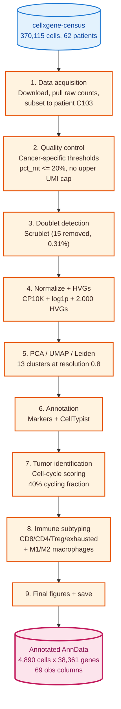

# Tumor scRNA-seq analysis (CRC patient C103)

Single-cell RNA-seq analysis of a colorectal cancer tumor sample using Scanpy. This is the first phase of a personal project I'm building toward Geneformer fine-tuning. Phase A (this repo) is the foundation: one CRC patient processed end-to-end. Phase B will add spatial transcriptomics. Phase C is the actual Geneformer fine-tuning step.

 

## Why I built this

I'm a bioinformatics scientist refreshing my single-cell skills on tumor data specifically. I'd worked with brain organoids before but never with cancer samples, and tumor scRNA-seq has its own gotchas (cell stress, aneuploidy, immune microenvironment dynamics) that don't show up in healthy-tissue analyses. I picked one patient from the Pelka et al. 2021 CRC atlas and worked through the full pipeline to rebuild the muscle memory before moving onto spatial and foundation-model work.

A few things that tripped me up along the way that are worth flagging:

1. **`adata.X` from cellxgene wasn't raw counts.** Cellxgene-curated datasets put a *normalized* expression matrix in `adata.X` and stash the actual raw UMI counts in `adata.raw.X`. I didn't realize this for a while and was effectively running QC on the wrong scale. The portfolio notebook now pulls `adata.raw.X` upfront so the rest of the pipeline operates on real counts.

2. **`sc.tl.score_genes` defaulting to `use_raw=True`.** I'd renamed `adata.var_names` to gene symbols, but `adata.raw.var_names` still held Ensembl IDs. So when `score_genes` looked for "CD8A" in raw it found nothing and returned zeros silently. Fix was `adata.raw = None` once at the end of Section 5.

3. **Mito threshold of 20%, not 5%.** Standard PBMC tutorials use 5%. Tumor cells live under metabolic stress and routinely run higher mito; a 5% cutoff would have thrown out most of the cells I wanted to study. 20% is the tumor-field consensus.

These all sound like trivial bugs, but each one took real time to diagnose. They're the kind of thing that doesn't show up in tutorials but absolutely will in real datasets.

## What I found

Patient C103 is a 45-year-old male with mismatch-repair-proficient (MMRp), left-sided colon adenocarcinoma (stage T1-T3, node-negative, low grade). MMRp is the more common but typically less immunotherapy-responsive subtype.

After QC and doublet removal I had 4,890 cells across 13 Leiden clusters:

- About 71% of cells are tumor epithelial across 5 sub-clusters (different states: cycling, ribosomal-high, differentiated colonocyte, PIGR+).
- 40% of all cells are in S or G2M cell-cycle phase, far above the <10% baseline for healthy adult tissue. Strong evidence the epithelial clusters are genuinely tumor, not normal-adjacent.
- The immune compartment (27% of cells) is dominated by regulatory T cells (51% of immune) and M2-polarized macrophages (2.6x M2 vs M1). Both are immunosuppressive.
- The cytotoxic T-cell compartment is small (4% of all cells) and already showing exhaustion markers (PD-1, TIM-3, LAG3).

This is a classic "cold tumor" immune signature, exactly what the MMRp / left-sided clinical features would predict. It would correspond to poor expected response from checkpoint immunotherapy.

## Dataset

[Pelka et al. 2021, *Cell*](https://doi.org/10.1016/j.cell.2021.08.003), "Spatially organized multicellular immune hubs in human colorectal cancer." About 371K cells from 62 CRC patients, 3' droplet scRNA-seq.

Accessed via [cellxgene-census](https://chanzuckerberg.github.io/cellxgene-census/). Source dataset ID: `16023185-de21-4c0d-a9c8-73abdd52d142`. Patient C103 was selected by filtering for tumor donors in the 5,000-15,000 cell range.

## What's in this repo

```
.
├── README.md
├── notebooks/
│   └── 01_phase_a_tumor_scrnaseq_FINAL.ipynb   # the analysis (with embedded outputs)
├── diagrams/
│   ├── 01_high_level_flowchart.md              # pipeline overview
│   ├── 02_detailed_flowchart.md                # function-level + AnnData state evolution
│   └── README.md
├── pyproject.toml                              # Poetry deps (pinned)
├── requirements.txt                            # pip mirror
└── poetry.lock
```

The downloaded source `.h5ad` (~3.5 GB), processed checkpoints, and figure PNGs live in gitignored `data/` and `figures/` folders on my local machine.

## Pipeline



For a more detailed function-level breakdown (every `sc.*` call and what columns it adds to `adata.obs` / `adata.var`), see [`diagrams/02_detailed_flowchart.md`](diagrams/02_detailed_flowchart.md).

## Setup

Requires Python 3.10 or 3.11 (cellxgene-census and CellTypist wheel availability).

```bash
# pin Python (uses pyenv if available)
pyenv local 3.10.10

# tell Poetry which interpreter to use
poetry env use $(pyenv which python3.10)

# install pinned dependencies (a few minutes)
poetry install

# launch the notebook
poetry run jupyter lab notebooks/01_phase_a_tumor_scrnaseq_FINAL.ipynb
```

The first run will download the ~3.5 GB Pelka dataset into `data/raw/` from cellxgene's CDN (cached for subsequent runs). Everything is then local.

Main libraries: scanpy 1.10.3, anndata 0.10.9, celltypist 1.6.3, cellxgene-census 1.16.2, plus the standard scientific Python stack. Full pinned list in `pyproject.toml`.

## A biological note on context

A solid tumor isn't just cancer cells. It's a multicellular ecosystem (the tumor microenvironment, or TME) containing malignant epithelial cells alongside infiltrating immune cells, fibroblasts, endothelial cells. Whether a patient responds to immunotherapy depends largely on what immune cells are present and what state they're in. That's why the second half of this notebook spends so much time on immune subtypes: counting cells isn't enough, the functional state matters.

CRC has a major molecular split: MMR-deficient (MMRd) tumors carry many mutations, attract T cells, and respond well to immunotherapy. MMR-proficient (MMRp) tumors, like C103, have few mutations and usually don't. About 85% of CRC is MMRp. This is the more clinically common but immunologically harder subtype.

## What I'd do differently / known limitations

- Single patient. Compositional findings here are illustrative, not population-level claims.
- For rigorous tumor-vs-normal classification I'd run inferCNV or copyKAT instead of just cell-cycle scoring. That requires R + a few hours of compute so I skipped it here.
- No batch correction needed (single sample), but a multi-patient extension would require Harmony, scVI, or similar.
- The CellTypist "Immune_All_Low" model is great for immune subtypes but unhelpful for epithelial / fibroblast / endothelial, so I had to fall back to marker-based annotation for those.

## What's next

**Phase B: spatial transcriptomics.** Add Visium or Xenium on a CRC tumor section. Map the cell types annotated here onto physical locations. Test for the multicellular "immune hubs" Pelka et al. reported. Probably use squidpy and cell2location.

**Phase C: Geneformer fine-tuning.** Use this annotated atlas (plus Phase B's spatial context) to fine-tune Geneformer for tumor-relevant downstream tasks: tumor-vs-normal classification, immunotherapy response prediction. Compare zero-shot vs fine-tuned performance.

## License

MIT for the analysis code. Data is Pelka et al. 2021 via cellxgene-census; see the original publication and cellxgene's Terms of Use.
