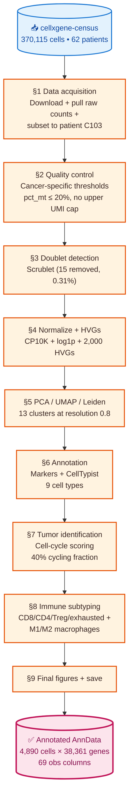

# Geneformer-Finetune — Phase A: Tumor scRNA-seq Analysis

[]() []() []() []() []()

End-to-end single-cell RNA-seq analysis of a **colorectal cancer (CRC) tumor sample** using the scverse/Scanpy stack.

## Project roadmap

| Phase | Topic | Status | What it adds |
|---|---|---|---|
| **A** — this repo | Single-sample scRNA-seq pipeline | ✅ **complete** | foundation: QC, clustering, annotation, immune subtyping |
| **B** — coming | Spatial transcriptomics integration (Visium / Xenium) | 🔜 planned | spatial context for the annotated cell types |
| **C** — coming | Geneformer fine-tuning | 🔜 planned | foundation-model embeddings, downstream prediction |

**This commit = Phase A.** It establishes the foundation skill — a complete, defensible scRNA-seq workflow on one CRC patient — that subsequent phases will build on.

## Headline findings — patient C103

A 45-year-old male with **MMR-proficient, left-sided colon adenocarcinoma** (stage T1–T3, node-negative, low grade).

| Property | Finding |
|---|---|
| **Sample composition** | 71% tumor epithelial (5 sub-clusters) · 27% immune · 3% stroma (4,890 cells total) |
| **Active proliferation** | 40% of cells in S/G2M cell-cycle phase (vs <10% in healthy tissue) |
| **Immune landscape** | Tregs at ~51% of immune compartment · Macrophages 2.6× M2 vs M1 |
| **Cytotoxic compartment** | Only 4% cytotoxic T cells; co-expressing PD-1, TIM-3, LAG3 exhaustion markers |
| **Clinical interpretation** | Classic "cold" tumor profile — predicted poor response to checkpoint immunotherapy |

## What's in this repo

```
.
├── notebooks/
│   ├── 01_phase_a_tumor_scrnaseq.ipynb        # The teaching notebook (long, exploratory, with errors and fixes)
│   └── 01_phase_a_tumor_scrnaseq_FINAL.ipynb  # The portfolio version (concise, polished, fixes applied)
│
├── data/
│   ├── raw/                                    # Downloaded source .h5ad goes here (~3.5 GB; gitignored)
│   └── processed/                              # Per-section checkpoints (gitignored)
│       └── 09_crc_donor_final_annotated.h5ad   # The Phase A deliverable
│
├── figures/                                    # Exported plots (UMAPs, violins, dot plots; gitignored)
│
├── diagrams/                                   # Mermaid pipeline diagrams
│   ├── 01_high_level_flowchart.md             # One-page pipeline overview
│   └── 02_detailed_flowchart.md               # Function-level + AnnData state evolution
│
├── learning/                                   # Personal study notes (gitignored)
│   ├── 01_section1_handbook.md ... 09_section9_handbook.md
│   └── _session_log.md
│
├── scripts/
│   ├── build_notebook.py                       # Generates the teaching notebook
│   └── build_portfolio_notebook.py             # Generates the portfolio notebook
│
├── pyproject.toml
├── requirements.txt
└── .gitignore
```

## Biological background

A solid tumor is not just "cancer cells" — it is a multicellular ecosystem, the **tumor microenvironment (TME)**. In CRC, the TME contains malignant epithelial cells (with lineage markers EPCAM, KRT8, KRT18) alongside tumor-infiltrating lymphocytes, tumor-associated macrophages, dendritic cells, cancer-associated fibroblasts, and endothelial cells. The composition and activation state of these populations shapes tumor progression, immune evasion, and response to therapy — particularly checkpoint immunotherapy, which works only when an existing T-cell response can be unleashed.

CRC has a key molecular dichotomy: **mismatch-repair-deficient (MMRd)** tumors carry many mutations and respond well to immunotherapy; **mismatch-repair-proficient (MMRp)** tumors have few mutations and typically don't. About 85% of CRC is MMRp. Patient C103 is MMRp.

## Dataset

[**Pelka et al. 2021, _Cell_**](https://doi.org/10.1016/j.cell.2021.08.003) — *"Spatially organized multicellular immune hubs in human colorectal cancer."*

The reference CRC scRNA-seq atlas. ~371K cells from 62 patients, profiled by 3' droplet scRNA-seq (10x Genomics).

- **Access:** [cellxgene-census](https://chanzuckerberg.github.io/cellxgene-census/)
- **Source data ID:** `16023185-de21-4c0d-a9c8-73abdd52d142`
- **Patient analyzed:** C103 — selected programmatically as a tumor donor with 5,000–15,000 cells.

## Analysis pipeline



For a detailed function-level breakdown (every `sc.*` call and what it adds to `adata.obs`/`adata.var`), see [`diagrams/02_detailed_flowchart.md`](diagrams/02_detailed_flowchart.md).

| Section | What it does | Key tool |
|---|---|---|
| 1 | Data acquisition + donor selection | `cellxgene_census.download_source_h5ad` |
| 2 | Quality control with tumor-appropriate thresholds | `sc.pp.calculate_qc_metrics` |
| 3 | Doublet detection and removal | `sc.pp.scrublet` |
| 4 | Normalization (CP10K + log1p) and HVG selection | `sc.pp.normalize_total`, `sc.pp.log1p`, `sc.pp.highly_variable_genes` |
| 5 | PCA + neighbor graph + UMAP + Leiden clustering | `sc.tl.umap`, `sc.tl.leiden` |
| 6 | Cell-type annotation: manual markers + CellTypist | `sc.tl.rank_genes_groups`, `celltypist.annotate` |
| 7 | Tumor identification via cell-cycle scoring | `sc.tl.score_genes_cell_cycle` (Tirosh et al. 2016) |
| 8 | Immune subtype refinement (CD8/CD4/Treg/exhausted + M1/M2) | `sc.tl.score_genes` |
| 9 | Final figures + annotated `.h5ad` deliverable | `sc.pl.umap`, `sc.pl.dotplot` |

## Setup

Requires Python 3.10 or 3.11 (cellxgene-census + CellTypist wheel availability).

```bash
# Pin Python (uses pyenv if available)
pyenv local 3.10.10

# Tell Poetry which interpreter to use
poetry env use $(pyenv which python3.10)

# Install pinned dependencies (~3–5 minutes)
poetry install

# Launch JupyterLab against the portfolio notebook
poetry run jupyter lab notebooks/01_phase_a_tumor_scrnaseq_FINAL.ipynb
```

The first run will download ~3.5 GB into `data/raw/` from the cellxgene CDN (cached for subsequent runs).

## Pinned dependencies

Core scientific stack:

- scanpy 1.10.3 · anndata 0.10.9 · numpy 1.26.4 · pandas 2.2.3
- scipy 1.13.1 · scikit-learn 1.5.2 · matplotlib 3.9.2 · seaborn 0.13.2
- leidenalg 0.10.2 · umap-learn 0.5.7 · h5py 3.12.1

Specialized tools:

- scikit-image 0.24.0 (Scrublet auto-threshold)
- scikit-misc 0.3.1 (Seurat v3 HVG selection)
- celltypist 1.6.3 (ML cell-type annotation)
- cellxgene-census 1.16.2 (dataset access)

See `pyproject.toml` for the full list and exact versions.

## Methods notes

**Cancer-specific QC thresholds.** Standard PBMC tutorials use `pct_mt < 5%` and an upper UMI cap. We use a relaxed mito threshold (≤ 20%) because tumor cells live under metabolic stress and routinely run higher mito fractions, and **no upper UMI cap** because tumor cells are physically larger and more transcriptionally active than immune cells — capping would preferentially discard the population of interest. Doublets are handled with Scrublet instead.

**Raw counts vs. cellxgene's pre-normalized data.** Cellxgene-curated datasets store the original integer UMI counts in `adata.raw.X` and a normalized matrix in `adata.X`. The portfolio notebook pulls raw counts from `adata.raw.X` immediately on load, ensuring the downstream normalization step operates on the correct scale.

**`use_raw=False` in `score_genes`.** Many Scanpy functions default to reading expression from `adata.raw` if present. Since we swap `adata.var_names` to gene symbols but `adata.raw.var_names` retains Ensembl IDs, downstream symbol-based lookups (cell-cycle scoring, immune subtyping) fail silently. The portfolio notebook drops `adata.raw = None` once at the end of Section 5 to prevent this class of bug.

## What I learned (Phase A)

- Always verify whether `adata.X` is raw counts or already-normalized — the cellxgene case taught me that the same dataset can ship with both, in different slots, and the wrong default produces silent corruption.
- The `adata.raw` slot is a frequent source of subtle bugs in symbol-based analyses. Drop it once gene symbols are in place.
- Tumor-specific QC thresholds matter — copy-pasting PBMC values can silently discard the cells you most want to study.
- Marker-based and CellTypist annotations are complementary, not redundant. Cross-validating catches errors in either direction.
- 0 cells dropped in QC is not a failure — for pre-cleaned datasets, the QC step is a (correct) no-op.
- Phenotyping the immune microenvironment (Treg fraction, M2/M1 ratio, exhaustion scores) connects cell-level scRNA-seq directly to clinical questions like immunotherapy response.

## What's next

### Phase B — Spatial transcriptomics (planned)

Layer in spatial transcriptomics on a CRC tumor section (Visium, Xenium, or MERFISH). Map the cell types annotated in Phase A onto physical locations in the tumor. Specific questions:

- Do the immune subtypes from Phase A (Tregs, M2 macrophages, exhausted CD8 T cells) co-localize into the "multicellular immune hubs" described in Pelka et al. 2021?
- Is the proliferating tumor compartment (Cluster 6 in Phase A) physically segregated from the more differentiated tumor states (Clusters 4, 5)?
- Are Tregs concentrated at the tumor-immune interface or distributed throughout?

Tools: `squidpy` (spatial neighborhood analysis), `cell2location` (deconvolution if using Visium), `CellChat` / `NicheNet` (spatial communication).

### Phase C — Geneformer fine-tuning (planned)

Use the Phase A annotated atlas (and Phase B's spatial context) to fine-tune **Geneformer**, a transformer pre-trained on 30M single cells from the [Genecorpus-30M corpus](https://huggingface.co/datasets/ctheodoris/Genecorpus-30M). Specific tasks:

- Fine-tune for tumor-vs-normal classification (a step beyond cell-cycle scoring).
- Predict immunotherapy response from cell-state embeddings.
- Compare zero-shot vs fine-tuned performance on cell-type classification.

Tools: `geneformer` (HuggingFace), `transformers`, possibly `scgpt` as comparison.

## Citation

If you use this analysis or build on Phase A:

```
@misc{arun_geneformer_finetune_2026,
  author = {Arun K.},
  title  = {Geneformer-Finetune: End-to-end tumor scRNA-seq analysis (Phase A — CRC patient C103)},
  year   = {2026},
  url    = {https://github.com/<your-username>/geneformer-finetune}
}
```

Original dataset: Pelka et al. 2021, *Cell* — "Spatially organized multicellular immune hubs in human colorectal cancer." [doi:10.1016/j.cell.2021.08.003](https://doi.org/10.1016/j.cell.2021.08.003)

## License

Analysis code: MIT.
Data: [Pelka et al. 2021, _Cell_](https://doi.org/10.1016/j.cell.2021.08.003) via cellxgene-census — see the original publication and the cellxgene Terms of Use.
