# Phase A — Pipeline Overview

Single-page overview of the 9-section pipeline, data flow, and checkpoint files.

> Renders automatically on GitHub. For a static PNG, see `01_high_level_flowchart.png` (generated via `mmdc -i 01_high_level_flowchart.md -o 01_high_level_flowchart.png`).

```mermaid
flowchart TB
    %% ============================================================
    %% Phase A — Tumor scRNA-seq Analysis (Pelka 2021 CRC, patient C103)
    %% ============================================================

    %% --- Source ---
    src[("📥 cellxgene-census<br/>370,115 cells • 62 patients<br/>~3.5 GB .h5ad")]:::source

    %% --- Section 1 ---
    s1["§1 Data acquisition<br/>━━━━━━━━━━━━<br/>• download .h5ad<br/>• pull raw counts from adata.raw<br/>• subset to patient C103<br/>• swap to gene symbols"]:::section
    cp1[/"💾 01_crc_donor_raw.h5ad<br/>6,096 cells"/]:::checkpoint

    %% --- Section 2 ---
    s2["§2 Quality control<br/>━━━━━━━━━━━━<br/>• flag MT and ribo genes<br/>• calculate QC metrics<br/>• tumor-appropriate thresholds<br/>  (pct_mt ≤ 20%, no upper UMI cap)"]:::section
    cp2[/"💾 02_crc_donor_qc.h5ad<br/>6,096 cells (0 dropped)"/]:::checkpoint

    %% --- Section 3 ---
    s3["§3 Doublet detection<br/>━━━━━━━━━━━━<br/>• Scrublet simulates fake doublets<br/>• score per real cell<br/>• auto-threshold at score 0.36<br/>• remove flagged cells"]:::section
    cp3[/"💾 03_crc_donor_postdoublet.h5ad<br/>6,042 cells (54 removed)"/]:::checkpoint

    %% --- Section 4 ---
    s4["§4 Normalization + features<br/>━━━━━━━━━━━━<br/>• preserve raw counts to layers<br/>• total-count normalize (CP10K)<br/>• log1p transform<br/>• HVG selection (seurat_v3, 2,000)"]:::section
    cp4[/"💾 04_crc_donor_normalized.h5ad<br/>6,042 cells • 2,000 HVGs flagged"/]:::checkpoint

    %% --- Section 5 ---
    s5["§5 Dim reduction + clustering<br/>━━━━━━━━━━━━<br/>• PCA on HVGs (50 components)<br/>• elbow plot → 30 PCs<br/>• 15-NN graph in PCA space<br/>• UMAP for 2D embedding<br/>• Leiden at res 0.4 / 0.8 / 1.5<br/>• selected resolution 0.8 → 13 clusters<br/>• drop adata.raw"]:::section
    cp5[/"💾 05_crc_donor_clustered.h5ad<br/>13 clusters"/]:::checkpoint

    %% --- Section 6 ---
    s6["§6 Cell-type annotation<br/>━━━━━━━━━━━━<br/>• rank_genes_groups (Wilcoxon)<br/>• dot plot vs TME cheat sheet<br/>• manual labels (5 tumor + 8 stromal/immune)<br/>• CellTypist (Immune_All_Low)<br/>• cross-validate"]:::section
    cp6[/"💾 06_crc_donor_annotated.h5ad<br/>9 cell types identified"/]:::checkpoint

    %% --- Section 7 ---
    s7["§7 Tumor identification<br/>━━━━━━━━━━━━<br/>• cell-cycle scoring (Tirosh 2016)<br/>• 43 S-phase + 54 G2M genes<br/>• per-cluster cycling fraction<br/>• 44.4% in S/G2M overall"]:::section
    cp7[/"💾 07_crc_donor_cycling.h5ad<br/>Cluster 6 most proliferative"/]:::checkpoint

    %% --- Section 8 ---
    s8["§8 Immune subtyping<br/>━━━━━━━━━━━━<br/>• score CD8 / CD4 / Treg / exhausted<br/>• score M1 vs M2 macrophages<br/>• per-cluster mean scores"]:::section
    cp8[/"💾 08_crc_donor_refined.h5ad<br/>Cold-tumor profile identified"/]:::checkpoint

    %% --- Section 9 ---
    s9["§9 Final figures + save<br/>━━━━━━━━━━━━<br/>• annotated UMAP<br/>• cell-type proportion barchart<br/>• marker dot plot (validation)<br/>• write final .h5ad"]:::section
    final[("✅ 09_crc_donor_final_annotated.h5ad<br/>6,042 cells × 38,361 genes<br/>67 obs columns<br/>295 MB")]:::final

    %% --- Phase B/C preview ---
    phaseB["🔬 Phase B — Spatial<br/>(Visium / Xenium)"]:::future
    phaseC["🧠 Phase C — Geneformer<br/>(foundation model fine-tune)"]:::future

    %% --- Flow ---
    src --> s1 --> cp1 --> s2 --> cp2 --> s3 --> cp3 --> s4 --> cp4 --> s5 --> cp5
    cp5 --> s6 --> cp6 --> s7 --> cp7 --> s8 --> cp8 --> s9 --> final
    final --> phaseB
    final --> phaseC

    %% --- Styles ---
    classDef source     fill:#E3F2FD,stroke:#1976D2,stroke-width:2px,color:#0D47A1
    classDef section    fill:#FFF3E0,stroke:#E65100,stroke-width:2px,color:#3E2723,text-align:left
    classDef checkpoint fill:#F1F8E9,stroke:#558B2F,stroke-width:1px,color:#1B5E20
    classDef final      fill:#FCE4EC,stroke:#C2185B,stroke-width:3px,color:#880E4F
    classDef future     fill:#F3E5F5,stroke:#7B1FA2,stroke-dasharray:5 5,color:#4A148C
```

---

## Reading the diagram

- **Blue oval (top):** raw data source on cellxgene-census.
- **Orange rectangles:** the 9 processing sections, each with the key operations.
- **Green parallelograms:** intermediate `.h5ad` checkpoints. Re-loading any checkpoint lets you skip everything before it.
- **Pink oval (bottom):** the Phase A deliverable.
- **Purple dashed (right):** future work (Phases B and C).

## At-a-glance numbers

| Stage | Cells |
|---|---|
| Source dataset | 370,115 |
| After donor + tumor filter | 6,096 |
| After QC | 6,096 (no cells failed) |
| After doublet removal | **6,042** (final analytical set) |

| Section | Key parameter |
|---|---|
| §2 | `pct_counts_mt ≤ 20%` (tumor-relaxed) |
| §4 | 2,000 HVGs · `target_sum=10_000` · `flavor="seurat_v3"` |
| §5 | 30 PCs · 15-NN · Leiden resolution 0.8 |
| §6 | CellTypist `Immune_All_Low` model |
| §7 | Tirosh 2016 S+G2M signatures |
| §8 | CD8/CD4/Treg/exhausted + M1/M2 signatures |
