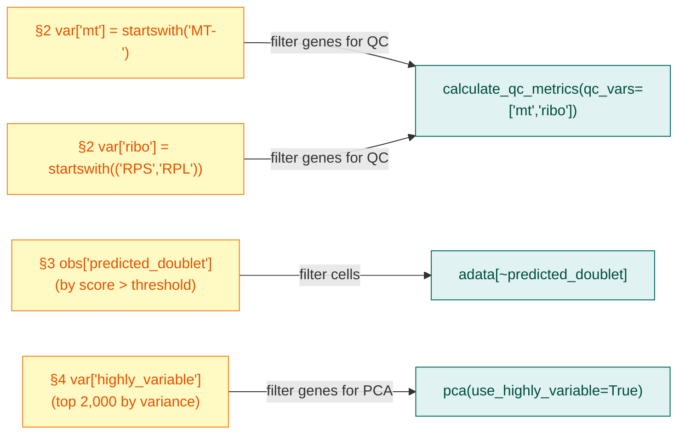

# Phase A detailed pipeline flowchart

Function-level breakdown showing every key call, its parameters, and what each step adds to the AnnData object. This is the one I keep open while reviewing the code.

---

## 1. AnnData state evolution

The diagram below shows the AnnData object's structure (`X`, `obs`, `var`, `layers`, `obsm`, `uns`) and how each section transforms it.

```mermaid
flowchart LR
    %% ==========================================================
    %% Detailed function-level pipeline + AnnData state evolution
    %% ==========================================================

    subgraph initial["Initial state (after §1 load)"]
        direction TB
        i_X["X — sparse, raw UMI counts<br/>(integer, float32)"]
        i_obs["obs — 47 columns from cellxgene<br/>(donor_id, disease, cell_type, QC, ...)"]
        i_var["var — 7 columns<br/>(gene symbol index, ensembl_id, ...)"]
    end

    subgraph s2["§2 QC adds:"]
        direction TB
        s2_obs["obs += n_genes_by_counts,<br/>total_counts, pct_counts_mt,<br/>pct_counts_ribo"]
        s2_var["var += mt (bool),<br/>ribo (bool)"]
    end

    subgraph s3["§3 Scrublet adds:"]
        direction TB
        s3_obs["obs += doublet_score,<br/>predicted_doublet"]
        s3_uns["uns += scrublet (threshold, etc.)"]
    end

    subgraph s4["§4 Normalize + HVG"]
        direction TB
        s4_X["X overwritten:<br/>raw counts → log1p(CP10K)"]
        s4_layers["layers['counts'] = raw counts<br/>(preserved for later tools)"]
        s4_var["var += highly_variable (bool),<br/>highly_variable_rank,<br/>means, variances, variances_norm"]
        s4_uns["uns += log1p, hvg metadata"]
    end

    subgraph s5["§5 PCA/UMAP/Leiden"]
        direction TB
        s5_obsm["obsm += X_pca, X_umap"]
        s5_varm["varm += PCs (gene loadings)"]
        s5_obsp["obsp += distances,<br/>connectivities (KNN graph)"]
        s5_obs["obs += leiden,<br/>leiden_0.4, leiden_0.8, leiden_1.5"]
        s5_uns["uns += pca, neighbors,<br/>umap, leiden"]
        s5_raw["adata.raw = None<br/>(drop, prevents use_raw bugs)"]
    end

    subgraph s6["§6 Annotation"]
        direction TB
        s6_obs["obs += cell_type_manual,<br/>predicted_labels, majority_voting,<br/>conf_score, over_clustering"]
        s6_uns["uns += rank_genes_groups"]
    end

    subgraph s7["§7 Cell cycle"]
        direction TB
        s7_obs["obs += S_score,<br/>G2M_score, phase"]
    end

    subgraph s8["§8 Immune subtyping"]
        direction TB
        s8_obs["obs += score_CD8_cytotoxic,<br/>score_CD4_helper, score_Treg,<br/>score_T_exhausted,<br/>score_Mac_M1, score_Mac_M2"]
    end

    initial --> s2 --> s3 --> s4 --> s5 --> s6 --> s7 --> s8

    classDef initial fill:#E3F2FD,stroke:#1976D2,color:#0D47A1
    classDef step    fill:#FFF3E0,stroke:#E65100,color:#3E2723
    classDef state   fill:#F1F8E9,stroke:#558B2F,color:#1B5E20

    class initial initial
    class s2,s3,s4,s5,s6,s7,s8 step
```

---

## 2. Function-level call graph

```mermaid
flowchart TB
    %% ==========================================================
    %% Function-level call graph for Phase A pipeline
    %% ==========================================================

    %% --- Section 1 ---
    subgraph S1["§1 Data acquisition"]
        direction TB
        f11["cellxgene_census.open_soma<br/>(census_version='latest')"]
        f12["cellxgene_census.download_source_h5ad<br/>(dataset_id, to_path)"]
        f13["sc.read_h5ad(local_h5ad)"]
        f14["adata = AnnData(X=adata.raw.X,<br/>obs=..., var=adata.raw.var)<br/><i>pull genuine raw counts</i>"]
        f15["pandas filter:<br/>donor_id == 'C103'<br/>AND disease == 'colon adenocarcinoma'"]
        f16["adata.var_names = adata.var['feature_name']<br/>adata.var_names_make_unique()<br/>adata.var.index.name = None"]
        f11 --> f12 --> f13 --> f14 --> f15 --> f16
    end

    %% --- Section 2 ---
    subgraph S2["§2 Quality control"]
        direction TB
        f21["adata.var['mt']  = startswith('MT-')<br/>adata.var['ribo'] = startswith(('RPS','RPL'))"]
        f22["sc.pp.calculate_qc_metrics<br/>(qc_vars=['mt','ribo'],<br/>percent_top=None, log1p=False, inplace=True)"]
        f23["filter:<br/>n_genes >= 200 AND<br/>total_counts >= 500 AND<br/>pct_counts_mt <= 20"]
        f21 --> f22 --> f23
    end

    %% --- Section 3 ---
    subgraph S3["§3 Doublet detection"]
        direction TB
        f31["sc.pp.scrublet(random_state=0)<br/><i>auto-threshold via skimage</i>"]
        f32["adata = adata[~predicted_doublet].copy()"]
        f31 --> f32
    end

    %% --- Section 4 ---
    subgraph S4["§4 Normalize + features"]
        direction TB
        f41["adata.layers['counts'] = adata.X.copy()<br/><i>preserve raw counts</i>"]
        f42["sc.pp.normalize_total(target_sum=10_000)"]
        f43["sc.pp.log1p(adata)"]
        f44["sc.pp.highly_variable_genes<br/>(n_top_genes=2000,<br/>flavor='seurat_v3',<br/>layer='counts')"]
        f41 --> f42 --> f43 --> f44
    end

    %% --- Section 5 ---
    subgraph S5["§5 Dim reduction + clustering"]
        direction TB
        f51["sc.pp.pca(n_comps=50,<br/>use_highly_variable=True,<br/>random_state=0)"]
        f52["sc.pp.neighbors(n_neighbors=15,<br/>n_pcs=30, random_state=0)"]
        f53["sc.tl.umap(random_state=0)"]
        f54["sc.tl.leiden(resolution=0.8,<br/>random_state=0)"]
        f55["adata.raw = None<br/><i>prevents downstream use_raw bugs</i>"]
        f51 --> f52 --> f53 --> f54 --> f55
    end

    %% --- Section 6 ---
    subgraph S6["§6 Annotation"]
        direction TB
        f61["sc.tl.rank_genes_groups<br/>('leiden', method='wilcoxon')"]
        f62["sc.pl.dotplot(<br/>var_names=marker_panel,<br/>groupby='leiden',<br/>standard_scale='var')"]
        f63["adata.obs['cell_type_manual'] =<br/>adata.obs['leiden'].map(manual_labels)"]
        f64["celltypist.annotate(<br/>model='Immune_All_Low.pkl',<br/>majority_voting=True,<br/>over_clustering='leiden')"]
        f65["pd.crosstab(<br/>cell_type_manual,<br/>majority_voting)<br/><i>validation</i>"]
        f61 --> f62 --> f63 --> f64 --> f65
    end

    %% --- Section 7 ---
    subgraph S7["§7 Tumor identification"]
        direction TB
        f71["s_genes = Tirosh 2016 list (43 genes)<br/>g2m_genes = Tirosh list (54 genes)"]
        f72["sc.tl.score_genes_cell_cycle<br/>(s_genes, g2m_genes)"]
        f73["adata.obs.groupby('leiden')<br/>[['S_score','G2M_score']].mean()"]
        f71 --> f72 --> f73
    end

    %% --- Section 8 ---
    subgraph S8["§8 Immune subtyping"]
        direction TB
        f81["sc.tl.score_genes<br/>(CD8: CD8A,B + GZMB,GZMK,PRF1)"]
        f82["sc.tl.score_genes<br/>(CD4: CD4, IL7R, LEF1, TCF7)"]
        f83["sc.tl.score_genes<br/>(Treg: FOXP3, IL2RA, CTLA4, IKZF2)"]
        f84["sc.tl.score_genes<br/>(Exhausted: PDCD1, HAVCR2, LAG3, TOX)"]
        f85["sc.tl.score_genes<br/>(M1: IL1B, TNF, CXCL9, CXCL10, CXCL11)"]
        f86["sc.tl.score_genes<br/>(M2: CD163, MRC1, MARCO, MSR1)"]
        f81 --> f82 --> f83 --> f84 --> f85 --> f86
    end

    %% --- Section 9 ---
    subgraph S9["§9 Final figures + save"]
        direction TB
        f91["sc.pl.umap(color='cell_type_manual')"]
        f92["proportions = value_counts(normalize=True)<br/>plt.barh"]
        f93["sc.pl.dotplot(<br/>var_names=marker_panel,<br/>groupby='cell_type_manual')"]
        f94["adata.write_h5ad(<br/>'09_crc_donor_final_annotated.h5ad')"]
        f91 --> f92 --> f93 --> f94
    end

    %% --- Flow between sections ---
    S1 --> S2 --> S3 --> S4 --> S5 --> S6 --> S7 --> S8 --> S9
```

---

## 3. Cross-section data dependencies

Some operations in later sections depend on outputs from earlier ones. This diagram shows the key dependencies (besides the obvious linear flow):

```mermaid
flowchart TB
    %% --- HVG selection in §4 depends on raw counts from §1 ---
    raw_counts["§1: raw integer UMI counts in X"]
    layers_counts["§4: layers['counts'] = X.copy()<br/>before normalization"]
    hvg["§4: highly_variable_genes(<br/>flavor='seurat_v3',<br/>layer='counts')"]
    raw_counts --> layers_counts --> hvg

    %% --- PCA uses HVG flag ---
    hvg_flag["§4: var['highly_variable']"]
    pca["§5: pca(use_highly_variable=True)"]
    hvg_flag --> pca

    %% --- Neighbors uses PCA output ---
    pca_out["§5: obsm['X_pca']"]
    neighbors["§5: neighbors(n_pcs=30)"]
    pca_out --> neighbors

    %% --- UMAP and Leiden both use the neighbor graph ---
    knn["§5: obsp['distances']<br/>obsp['connectivities']"]
    umap["§5: tl.umap()"]
    leiden["§5: tl.leiden()"]
    knn --> umap
    knn --> leiden

    %% --- Annotation needs clustering ---
    leiden_col["§5: obs['leiden']"]
    rank["§6: rank_genes_groups(groupby='leiden')"]
    leiden_col --> rank

    %% --- CellTypist uses majority voting on clusters ---
    celltypist_step["§6: celltypist.annotate(<br/>over_clustering='leiden')"]
    leiden_col --> celltypist_step

    %% --- Cell cycle scoring needs log-normalized X ---
    log_X["§4: X = log1p(CP10K-normalized)"]
    cc_score["§7: score_genes_cell_cycle(use_raw=False)"]
    log_X --> cc_score

    %% --- Immune subtyping also needs log X ---
    immune_score["§8: score_genes(use_raw=False)"]
    log_X --> immune_score

    classDef stateNode fill:#F1F8E9,stroke:#558B2F,color:#1B5E20
    classDef funcNode fill:#FFF3E0,stroke:#E65100,color:#3E2723
    class raw_counts,layers_counts,hvg_flag,pca_out,knn,leiden_col,log_X stateNode
    class hvg,pca,neighbors,umap,leiden,rank,celltypist_step,cc_score,immune_score funcNode
```

---

## 4. The 4 "flag column" pattern

Throughout the pipeline, the same pattern recurs: add a True/False column, then filter by it. This is a unifying mental model.

---

## 5. Key parameters reference table

| Section | Parameter | Value used | Why this value |
|---|---|---|---|
| §1 | donor cell count target | 5,000–15,000 | Laptop-friendly; enough cells for clustering |
| §2 | `pct_counts_mt` threshold | ≤ 20% | Tumor cells are metabolically stressed; PBMC's 5% is too strict |
| §2 | `total_counts` upper cap | none | Tumor cells legitimately have high UMIs; capping discards them |
| §3 | `random_state` | 0 | Reproducibility (Scrublet is stochastic) |
| §4 | `target_sum` | 10,000 | Convention; gives readable numbers ("CP10K") |
| §4 | `n_top_genes` | 2,000 | Standard balance — enough to capture biology, few enough to suppress noise |
| §4 | HVG `flavor` | seurat_v3 | Modern default; works on raw counts via `layer='counts'` |
| §5 | `n_comps` (PCA) | 50 | Compute all of them; select cutoff visually |
| §5 | `n_pcs` (neighbors) | 30 | From elbow plot; slightly generous |
| §5 | `n_neighbors` (KNN) | 15 | Scanpy default; balanced smoothing |
| §5 | Leiden resolution | 0.8 | Selected over 0.4 (too coarse) and 1.5 (over-clustering) |
| §6 | CellTypist model | Immune_All_Low | Immune-focused, subtype-granularity reference |
| §6 | `majority_voting` | True | Smooths per-cell predictions within clusters |
| §7 | gene lists | Tirosh 2016 (43 + 54) | Canonical S+G2M cell-cycle signatures |
| §7-8 | `use_raw` | False | adata.raw retains Ensembl IDs; pass False to use gene-symbol-indexed X |
